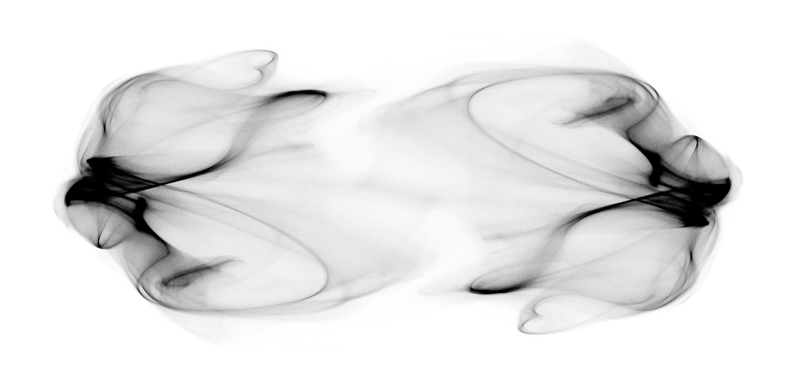

## Meetings:
Wednesdays, 10.15 - 11.45 am

## Location:
[Jerome L Greene Science Center, 6th floor room L6-087](https://www.google.com/maps/place/Jerome+L.+Greene+Science+Center/@40.816851,-73.960152,17z/data=!3m1!4b1!4m5!3m4!1s0x89c2f669953b6523:0xc3a414ae00347fea!8m2!3d40.816847!4d-73.957958)

## Registration:
[Please register via Courseworks](https://courseworks2.columbia.edu/courses/80163)

## Schedule
### Encoding and Decoding
* Jan 23 *Intro* (Fabio Stefanini) [Lecture](https://github.com/RainerEngelken/neurotheory-seminar-2019/blob/master/lec01_stefanini.pdf)  [Exercise](https://github.com/RainerEngelken/neurotheory-seminar-2019/blob/master/lec01_exercise.pdf)  [Notebook](https://github.com/RainerEngelken/neurotheory-seminar-2019/blob/master/lec01_exercise.ipynb) 
* Jan 30 *Linear & Logistic Regression* (Ramon Nogueira, Josh Glaser) [Material](https://github.com/RainerEngelken/neurotheory-seminar-2019/blob/master/E%26D_I.pdf)
* Feb 06 *GLM & Nonlinear Regression* (Ramon Nogueira, Josh Glaser) [Material](https://github.com/RainerEngelken/neurotheory-seminar-2019/blob/master/E%26D_II.pdf) [Notebook with Exercise](https://gist.github.com/RainerEngelken/6a17d17d4c0467d8a8430c030935a897)
* Feb 13 *Static Models for Dimensionality Reduction* (Matt Whiteway) [Material](https://github.com/RainerEngelken/neurotheory-seminar-2019/blob/master/em-notes-matt-whiteway.pdf) [Notebook with Exercise](https://github.com/RainerEngelken/neurotheory-seminar-2019/blob/master/dim-reduction.ipynb) 
* Feb 20 *Dynamic Models for Dimensionality Reduction* (Shreya Saxena) [Material](https://github.com/RainerEngelken/neurotheory-seminar-2019/blob/master/dyn-models-dim-red-notes-shreya-saxena.pdf)
* Feb 27 *Cosyne*  
* Mar 06 *Cosyne*  
* Mar 13 *Hackathon Encoding & Decoding*  

### Mechanistic Models of Neural Circuits
* Mar 20 *Intro. From Spiking Models to Population Rate Part I* (Laureline Logiaco) [Material](https://github.com/RainerEngelken/neurotheory-seminar-2019/blob/master/Logiaco_v2019.pdf)  
* Mar 27 *From Spiking Models to Population Rate Part II* (Laureline Logiaco)  
* Apr 03 *Inhibition Stabilized Networks & Supralinear Stabilized Networks* (Mario Dipoppa) [Material](https://github.com/RainerEngelken/neurotheory-seminar-2019/blob/master/mario-session-1.zip)  
* Apr 10 *Neural Variability in Rate Models, Spiking vs. Rate Models* (Mario Dipoppa) [Material](https://github.com/RainerEngelken/neurotheory-seminar-2019/blob/master/mario-session-2.zip)   
* Apr 17 *Equilibrium Theory for Hopfield Model* (Alessandro Ingrosso)  
* Apr 24 *Dynamic Mean Field Theory of Chaotic Rate Networks* (Alessandro Ingrosso)  

### Learning in Recurrent Networks
* May 01 *Intro. Learning in Recurrent Networks, Backprop Through Time* (Rainer Engelken) [Material](Cueva2018_THESIS_chapter1.pdf) 
* May 08 *Least-Squares, RLS, FORCE, Kalman Filters* (James Murray) [Material](https://github.com/RainerEngelken/neurotheory-seminar-2019/blob/master/RLS_Lecture_May2019.pdf)  [Notebook with Exercise](https://github.com/RainerEngelken/neurotheory-seminar-2019/blob/master/FORCE_Example_Homework2.ipynb)
* May 15 *Dynamic Mean Field Theory for Low-Rank Static Solutions* (Rainer Engelken)  
* May 22 *Control Theory for Low-Rank Static Solutions* (James Murray) [Material](https://github.com/RainerEngelken/neurotheory-seminar-2019/blob/master/RNN_Stability_Lecture_JM.pdf)

* May 29 *Bonus*  

